# Electronics Module

{{BOM}}

The role of the electronics module is to provide control over the loader system.  Specifically, it has at least 7 channels of 24V relays for solenoid valves, 3 digital inputs for interlocks (arm up / arm down / door closed), and can be used to drive a pressure controller, though we typically do that via a LabJack.
An alternative electronics module is entirely built around a LabJack using their relay module.  These are much higher cost, but avoid needing a separate computer/Raspberry Pi and network backend.

Materials:
	1 x AFL electronics module enclosure 
1 x front cover
1 x top plate cover
	3 x RJ45 jack 
		Switch: McMaster-Carr # 7395K29 or equivalent
		DB9 female connector, panel mount
		DC connector, 2.1 mm, McMaster # 8320N115 or equivalent
		24 V, 1 A, 2.1 mm, center - AC/DC adapter McMaster 70235K85 or equivalent
		Hookup wire
		Raspberry Pi
		64GB high endurance SD card
		PiPLATES RelayPLATE
		PiPLATES PowerPLATE24
		Short (1 ft) RJ45 patch cable or bare CAT5e cable and termination tools		
		4 x  #2-56 x ¼” screws (length need not be exact)
 
## Prepare the Housing {pagestep}

{{includetext: "{previewpage}", if: targetformat is html}}

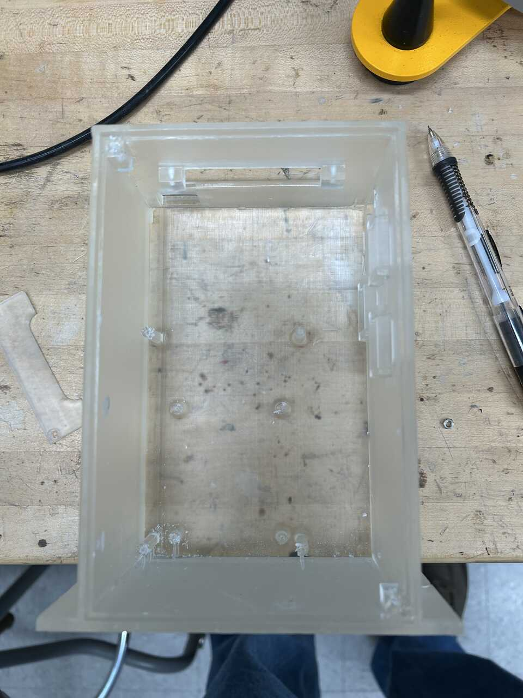

* 3D print the [AFL Electronics Module]{Qty: 1}, [AFL Electronics Module Cover]{Qty: 1}, and [AFL Electronics Module Top Cover]{Qty: 1} and tap the 4 cover mounting holes using a [#4-40 tap]{Qty: 1, Cat: tool}, and the 8 Raspberry Pi and LabJack mounting holes using a [#2-56 tap]{Qty: 1, Cat: tool}.		
## Prepare the Raspberry Pi and other boards {pagestep}
The base of the electronics stack is a [Raspberry Pi]{Qty: 1}.  

* Follow the instructions in the [Pi flashing appendix](PrepareRaspberryPis.md) to prepare a [SD card (min. 64gb, high endurance)]{Qty:1} with hostname “piloader” and password.  Install that MicroSD card into the Pi.

* At this point it’s prudent to make any future connections needed to the Pi as getting to the connectors and SD card slot will be much more painful later!  In particular, attach a network cable ([1-3 ft CAT5e patch cable]{Qty: 1}) and any USB devices you might want, plus video if you want it.  Run these wires up and out the top hole of the enclosure.

* Install the Pi into the four #2-56 tapped holes in the bottom of the electronics board using [#2-56 screws, 1/4" long](Parts.yaml#256Screw14inSS){Qty: 4}.

## Prepare the Pi-Plates and Pi stack

See the Pi-Plates POWERplate24 docs [here](https://pi-plates.com/powerplate24-users-guide/) for more details.

* From the Pi-plates POWERplate bag, remove the heatsinks and install them on the Pi - the large silver chip, the one above it , and the one above and to the right of that:

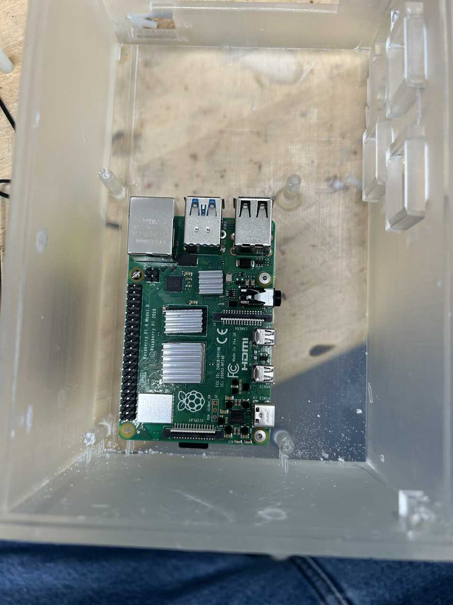 

* Install the provided realtime clock battery in the PowerPLATE24.

* Configure the power in: we will be using 24VDC in with no UPS, so short pins 5 & 6 and 1 & 2 (counting from top).  This is how it shipped from the factory for me, but check!

* Remove at least one of the passthrough / accessory power connectors on the right side of the board.

* Make-up the input power connector using the [DC connector, 2.1 mm]{Qty: 1} and the [2.1 mm DC connector]{Qty: 1}.  Connect the red lead of the connector to the leftmost position of the 6-pin header that comes with the PowerPLATE24.  Connect the black lead to the second-leftmost position.

* Align the 40 pin header of the [Pi-Plates PowerPLATE24]{Qty:1} to the Raspberry Pi and press down firmly to seat.  Attach the PowerPLATE to the standoffs for mounting using nesting standoffs.

* On the RelayPLATE, we need to jumper the 24V input across the common of all relays.  I usually do this with short lengths of wire like so:

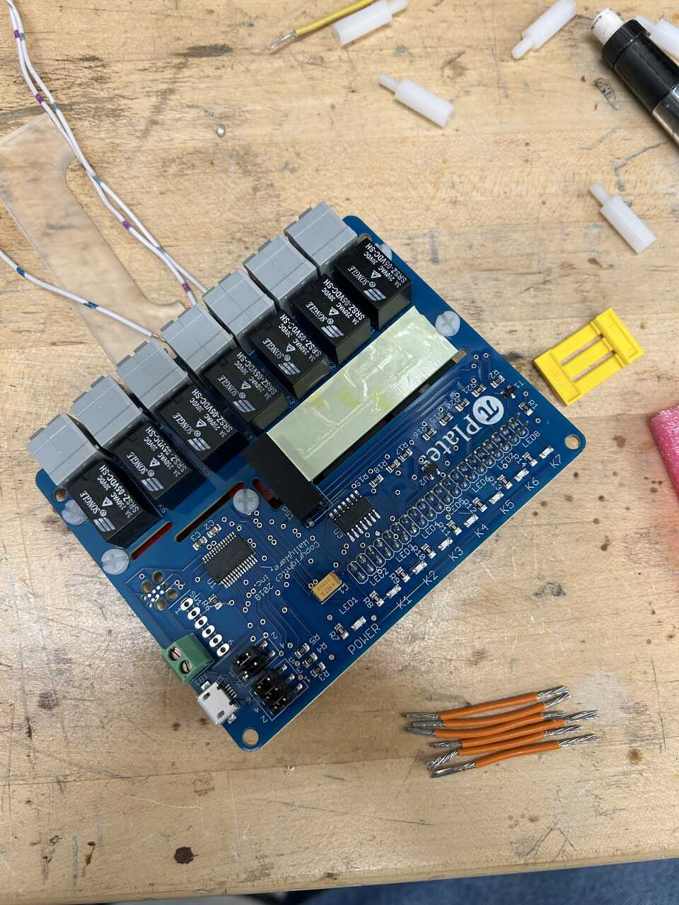

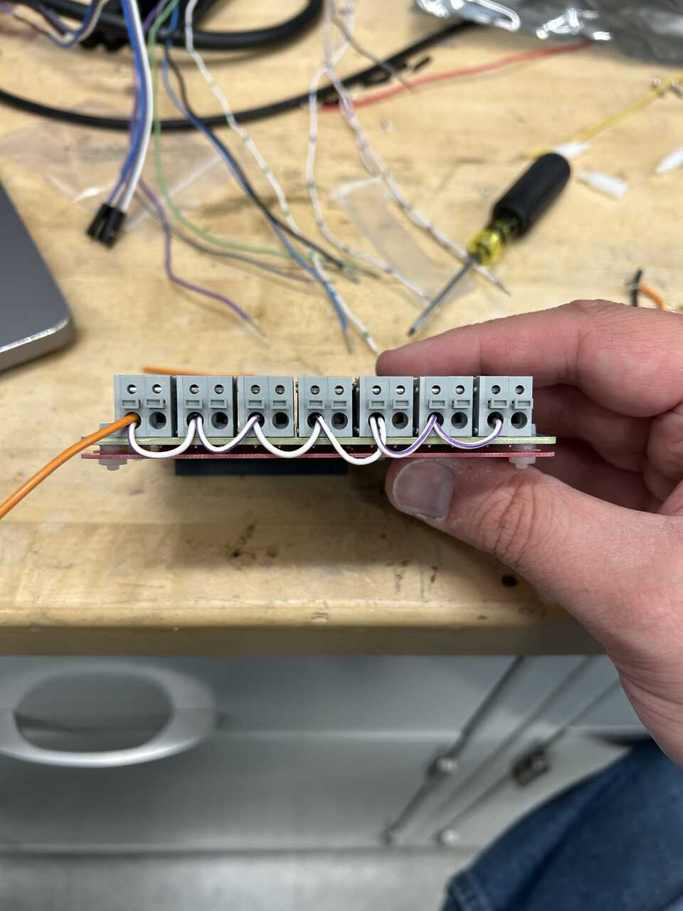

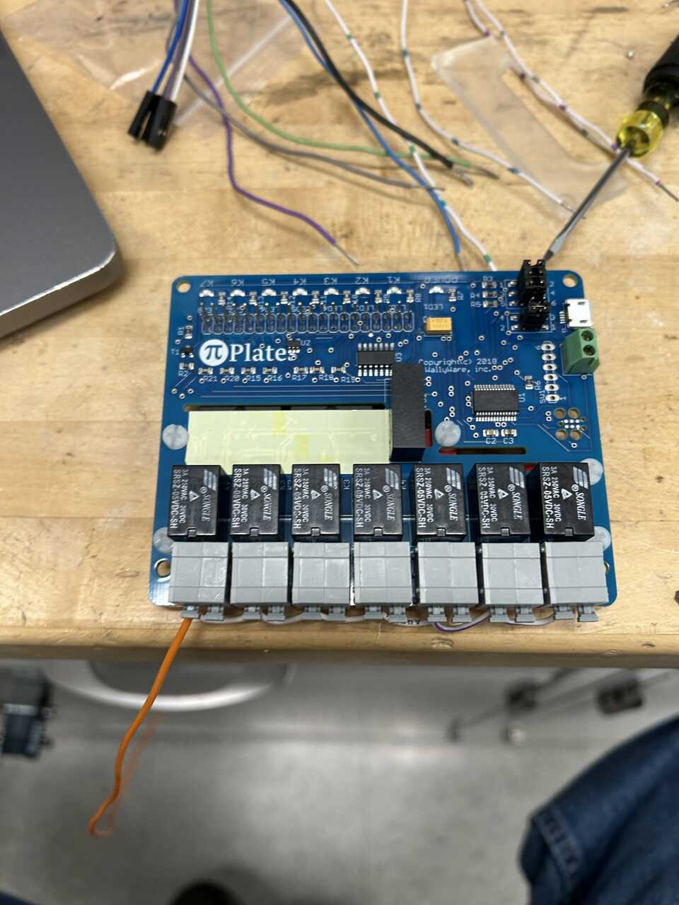 

Leave a long, dangling end of wire to connect to the main shutoff switch.

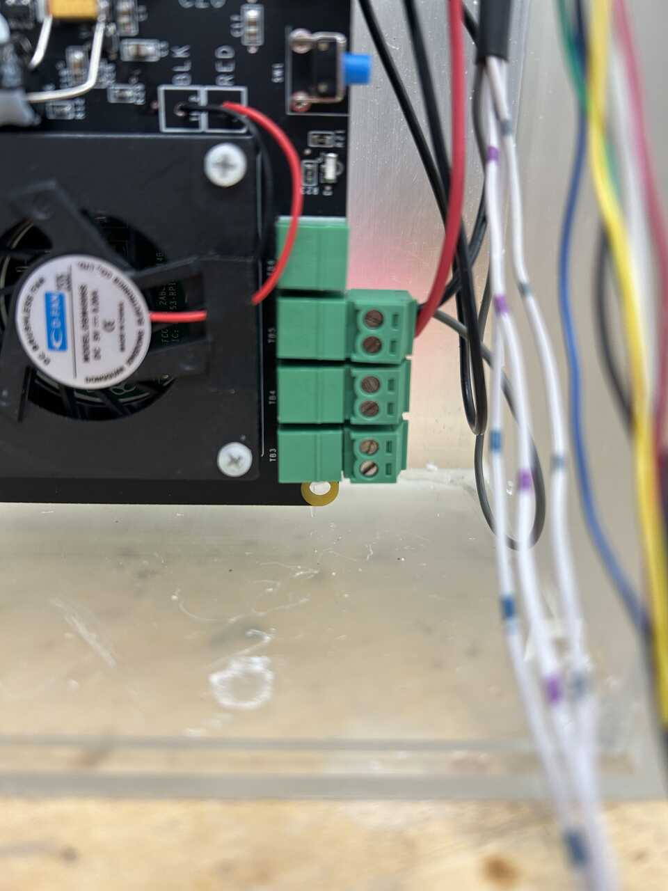

* Align the 40 pin header of the [Pi-Plates RelayPLATE]{Qty: 1} to the Raspberry Pi and press down firmly to seat.  Attach the RelayPLATE to the standoffs for mounting using screws.

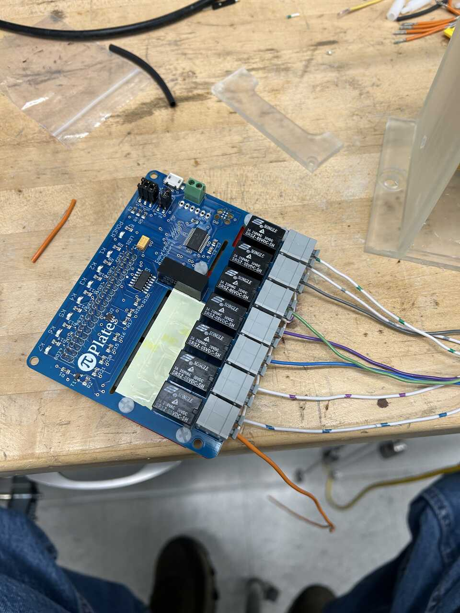

## Prepare the housing and components {pagestep}

* To the [solder-cup DB9 female connector, panel mount]{Qty: 1} solder jumper wires to pins 1-6.  These will match the pinout used in the in-robot module, so it may be prudent to match colors if you used them or will use them there.  But it is entirely arbitrary.  Note down the pin number and corresponding color for later.

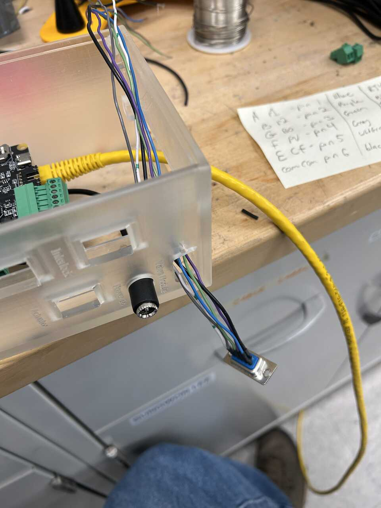

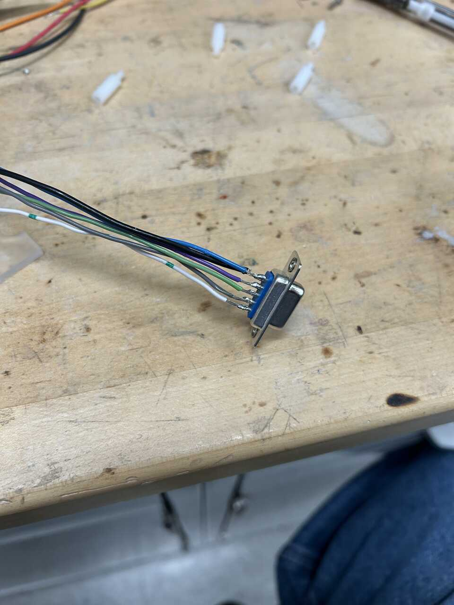

* Prepare the female RJ45 connector to connect to the pneumatic module.  Take a punchdown-style RJ45 jack and run jumper wires matching the pneumatic module:

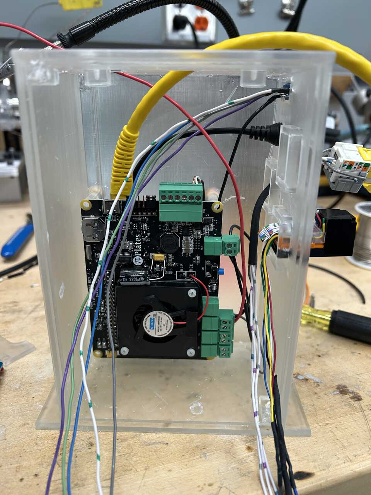

| Pin | Color | Function |
| --- | --- | --- |
| 1   | Red   | Up |
| 2   | Black | Up-Common |
| 4   | Blue  | Down |
| 5   | Black | Down-Common |
| 7   | Purple| Enable |
| 8   | Black | Enable-Common |

As above, the colors are entirely arbitrary.  I recommend using one wire for all the "common" terminals (2, 5, and 8) and running it through the connector for simplicity.

* Strip ~ 1/4" of insulation from the dangling ends of these two harnesses.

* Prepare the female RJ45 connector to connect to the interlock harness.  Take a punchdown-style RJ45 jack and run jumper wires (I like to use [RasPi pin jumper wires]{Qty: 4}) matching the interlock harness:

| Pin | Color | Function |
| --- | --- | --- |
| 1   | Blue   | Arm Up |
| 2   | White | Arm Up-Common |
| 4   | Purple  | Arm Down |
| 5   | White | Arm Down-Common |
| 7   | Gray| Door Open |
| 8   | White | Door Open-Common |

As above, the colors are entirely arbitrary.  I recommend using one wire for all the "common" terminals (2, 5, and 8) and running it through the connector for simplicity.  This line must never see the 24V system - you will fry the digital inputs.

* To the power connector from the PowerPLATE, attach a length of hookup wire.  This will go to the power switch together with the input line from the relay board.

* To the power outlet connector (2 pin) removed from the PowerPlate, attach a length of [2 conductor hookup wire]{Unit: ft, Qty_Value: 6}.  This will power the dispense controller.  Common on the right pin, positive on the left.

* Start installing the prepared wire harnesses to the housing.   I like to start with the DC connector.  You can go ahead and connect the main (Pi) power harness at this time:

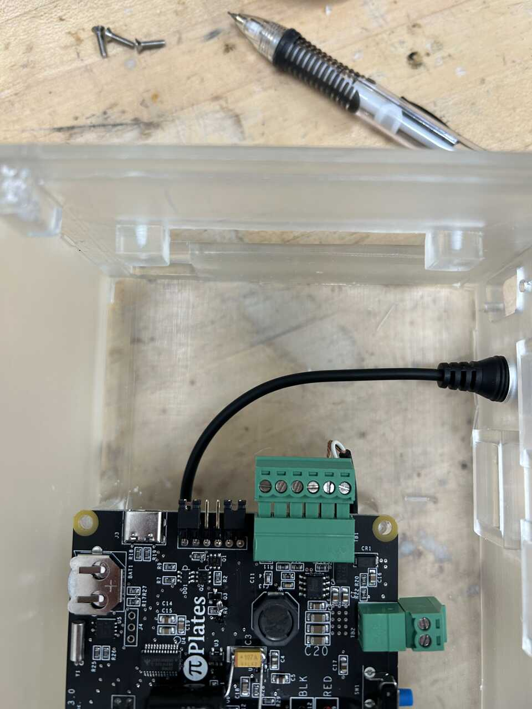 

Next the DB9 connector, threading the wires in from the outside and securing with glue or standoff screws:

Next, the RJ45 connectors.  Let's start with the pneumatic module one.  These standard keystone jacks snap in from the inside with an upward twist.  It can take a bit of force, but they should seat solidly.  The pneumatic module "actuator" slot can be hard to reach.

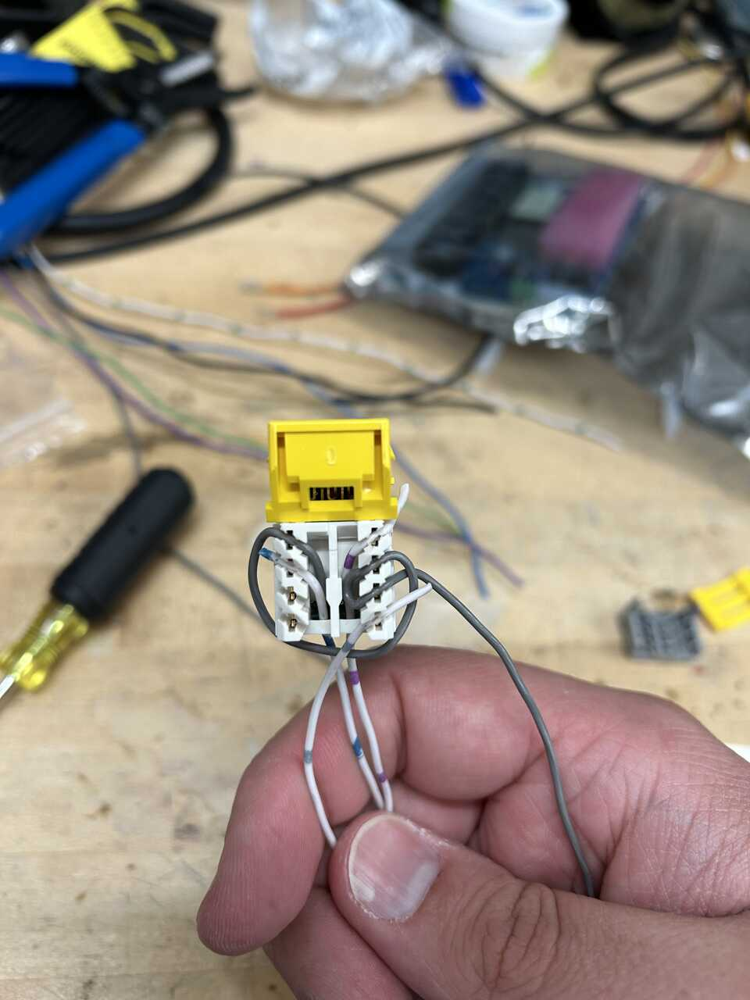

Proceed with the interlock connector.  Note that in the pictures, the connectors are not fully seated - I did not have the right connector during this build.

* Now, let's make up the final connections.  

   * Connect the common lines from the DB9 connector (pin 6) and pneumatic module RJ45 to the DC out connector fron the PowerPLATE, both on the right terminal with screws up looking at the terminals.  Connect a jumper wire to the left terminal and thread it out the switch port at the top.

   * Connect the second DC out connector from the PowerPLATE with the attached dispense line to the plate, threading the cable in the top opening of the box.

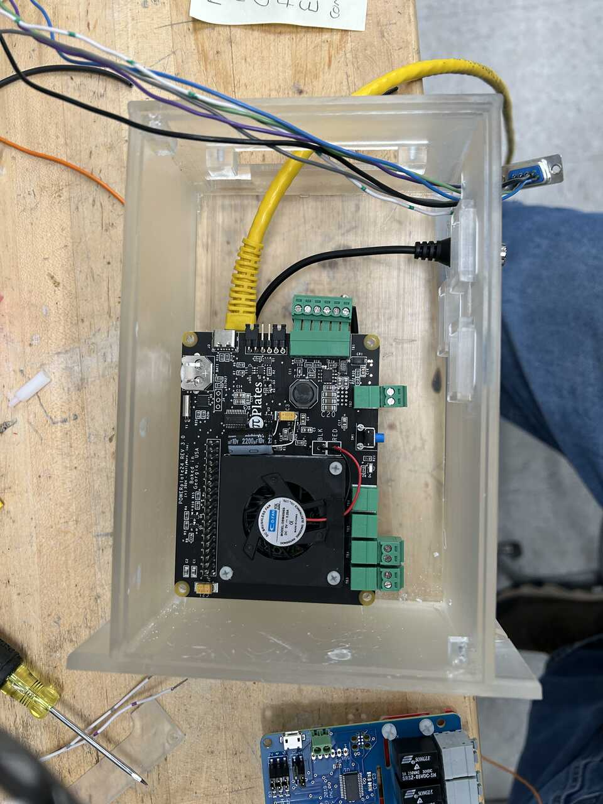

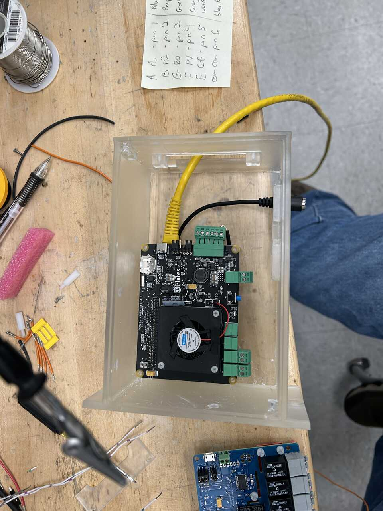

   * Working from top to bottom of the RelayPLATE, connect the unoccupied terminals on each relay to the appropriate line.  The pinout can be changed in configuration later, but the default is as follows:

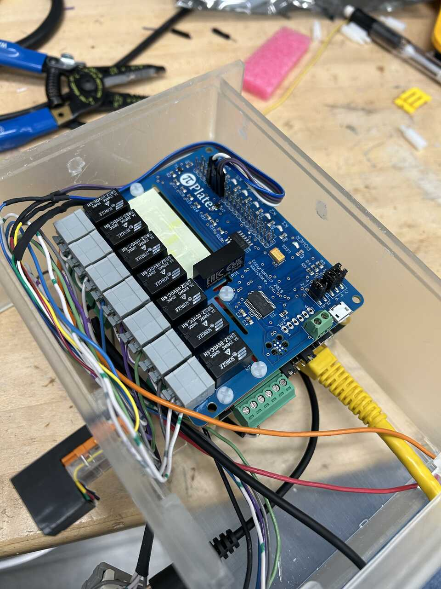
		Relay # | Connector | Function
		--- | --- | ---
		1 | RJ45 | Arm Up
		2 | RJ45 | Arm Down
		3 | DB9 | Rinse 1
		4 | DB9 | Rinse 2
		5 | DB9 | Blowout
		6 | DB9 | Piston Vent
		7 | DB9 | Cell Flow Through
		
		
	NOTE! The relays are numbered from bottom to top as installed.
	The "system enable valve" pin on the RJ45 connector, can be connected to the relay common side at the end of the board, or the top switch, any source of SWITCHED 24V power.

	Double check the connections to the RelayPLATE, tug the cables gently to ensure they are secure, etc.  Re-doing this is painful!

	Thread the relayboard input power out the switch opening.  This is the power input to the valves.

	
* Install the RelayPLATE atop the PowerPLATE to form a stack.  Ensure it is aligned on the connector below.

* Connect the two dangling leads to the master enable switch, and snap the switch in place.

* Connect the interlock pins to the top of the Pi-plates stack.  I recommend the cluster of pins  9 - 15 on the top left (with the top connector facing you, pins 5-8 on the left side) These are, in order, GND - GPIO17 - GPIO27 - GPIO22.  I usually attach GND = GND, GPIO17 = Arm Up, GPIO22 = Arm Down, GPIO27 = Door Open. 

* Do one final visual check of the wiring, then...

* Attach the front and top covers using [#4-40 screws, 1/4" long](Parts.yaml#440Screw14inSS){Qty: 4}

Done!