[M4x10 screws]:Parts.yaml#M4x10PanSteel
[No. 2 Phillips screwdriver]:Parts.yaml#Screwdriver_Philips_No2
# In-Robot Module

{{BOM}}

The in-robot module is the combination of actuator, piston head, catch, frame, and dispense valves that physically sits inside your liquid handler - specifically, in slot 10 of an OT-2.

## Assemble the valve box {pagestep}

{{includetext: "{previewpage}", if: targetformat is html}}

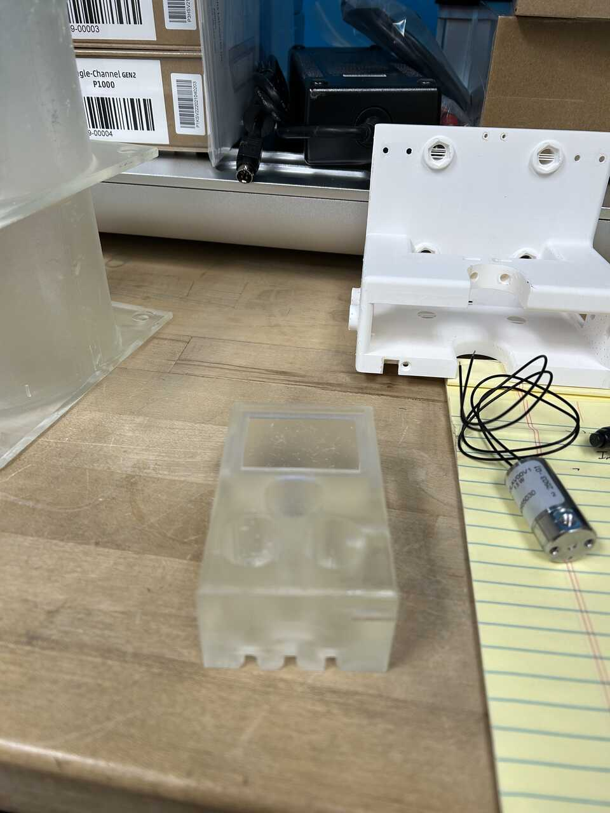

* 3D Print the [AFL in-robot valve box](ValveBox.md){Qty: 1} and tap the two, 1/4"-20 threaded holes on the side.
* Attach 2 [1/8" x 10-32 push connect fittings](Parts.yaml#PushConnectFitting1032){Qty: 6} to each of the 3 [low-flow solenoid valves](Parts.yaml#LowFlowSolenoidValve){Qty: 3} and tighten to engage the O-ring on the fitting.  Do not use teflon tape on these threads; the O-ring is doing that job.

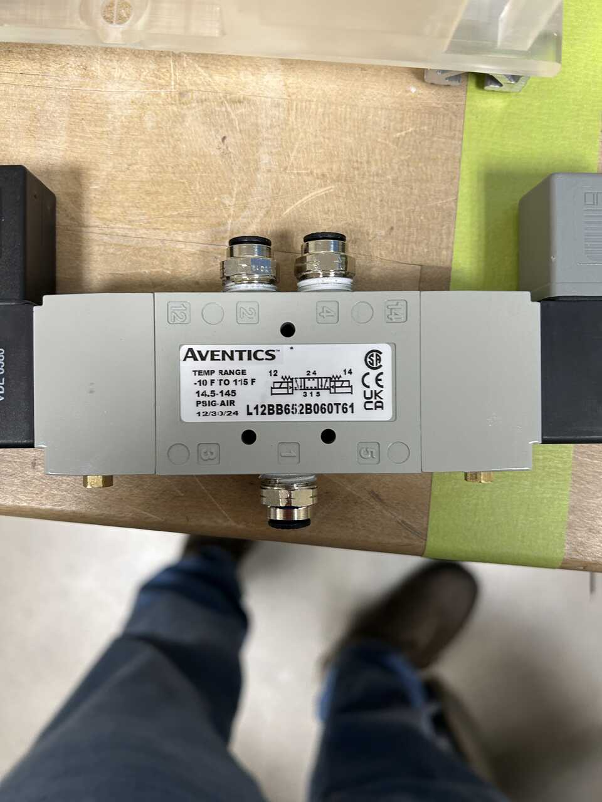
* Insert the assembled valves into the box and thread their wires down through the grooves on the bottom into the "electronics area" on the rear of the box.  It can be helpful to label one wire from each valve (these will be the control/positive terminals; the 3 unlabeled wires are common and will all be tied together).

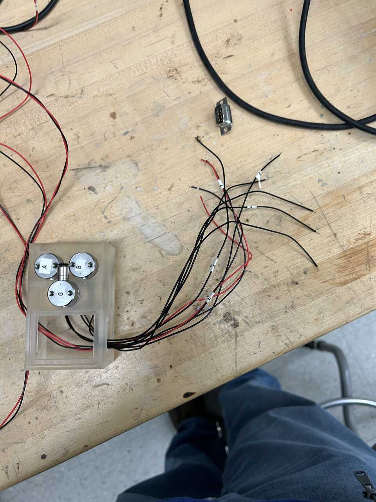
>i **Note** 
>i These valves do not have a polarity, so you can just arbitrarily pick a negative wire.  The Burkert "whisper valves" used for post-sample and piston vent *do* have polarity, and for those valves the black wire should be used as negative.
* Take the [Burkert valve connector]{Qty: 1} and the [dangling RJ45 jack]{Qty: 1}, and fish the ends through the right side of the box into the connector space.  It can be prudent to reduce the length of the Burkert connector to about 1 m to make it easier to connect to the electronics box.  To make a dangling RJ45 jack, there are several options... easiest is to take a short length of hookup wire and terminate on pins 4 and 5 (center two) of the RJ45.  Put negative/common on pin 5, and positive on pin 4.  You can also cut a RJ11 or RJ45 extender in half, though you'd have to identify the wires...

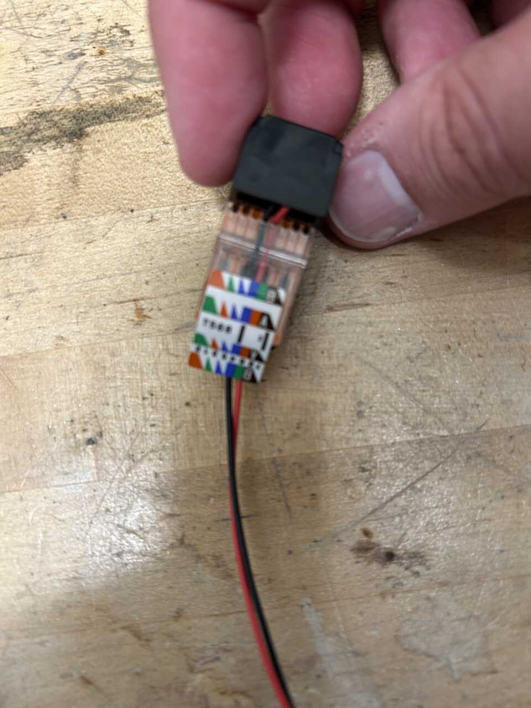
* Populate the [DB9M serial connector](Parts.yaml#DB9MConnector){Qty: 1} using the new leads according to the following pin diagram.  You can terminate the wires using solder into a solder cup connector, but a screw terminal solution would be better.  Tie all the common wires together before landing on the connector: 
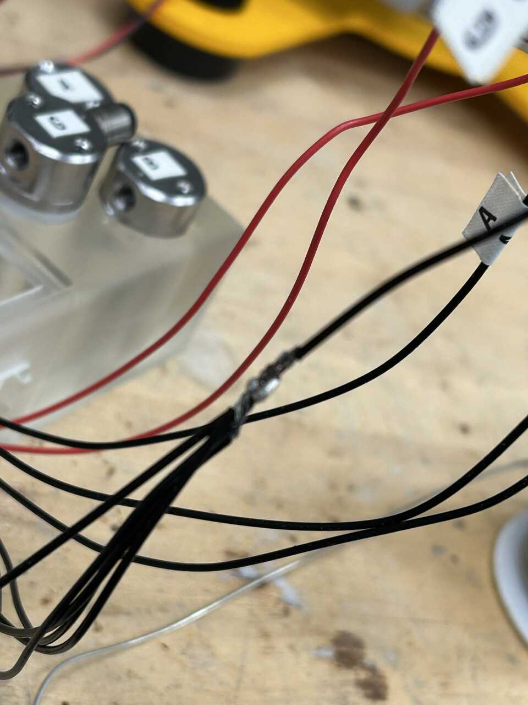

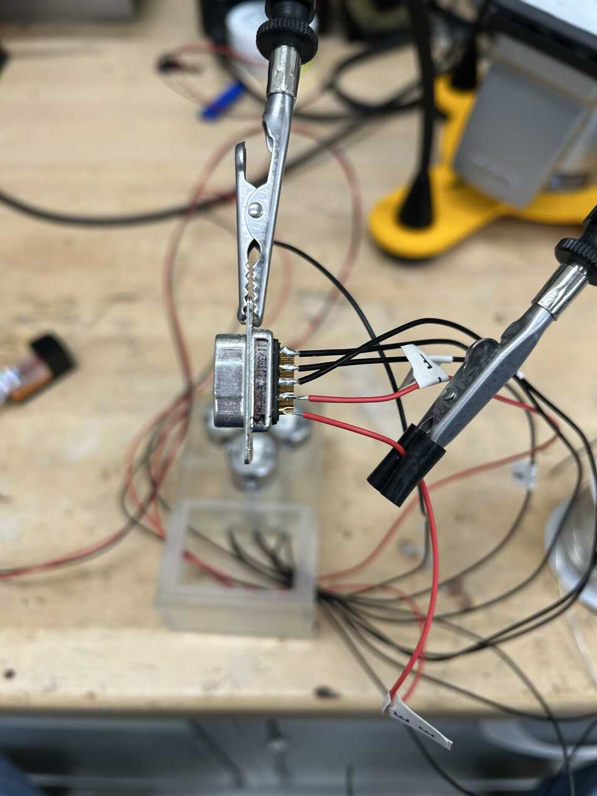
    * Connector #1 - Electronics box to loader

    * (BLACK)  #1 RINSE 1
    * (BROWN)  #2 RINSE 2
    * (RED)    #3 BLOWOUT
    * (ORANGE) #4 PISTON VENT
    * (YELLOW) #5 CELL FLOW THRU
    * (GREEN)  #6 COMMON
    * (BLUE)   #7 no longer used (legacy LIMIT SUPPLY +5V)
    * (PURPLE) #8 no longer used (legacy FULL-UP LIMIT)
    * (GRAY)   #9 no longer used (legacy FULL-DOWN LIMIT)

    (WHITE)  SH GROUND

* For the cell flow-thru valve, connect a [dangling RJ11 jack]{Qty: 1} to the appropriate ports on the valve box.  Use the center two pins of the RJ11 jack (typically the yellow and green wires, with the yellow wire going to the positive terminal).

* Secure the connector into place using [UV-set glue or epoxy].  Place the [AFL in-robot valve box cover]{Qty:1} into place.

## Assemble the interlock harness {pagestep}

{{includetext: "{previewpage}", if: targetformat is html}}

This is a separate component because there is significant risk of inductive crosstalk between the 24V solenoid/relay lines and these switches which can fry DAQ hardware.  It’s happened, several times.

* 3D print the [robot door switch carrier](RobotDoorSwitchCarrier.md){Qty: 1}; multiple copies can be helpful as this is a fragile part.  
* Glue two strong [neodymium magnets]{Qty: 2} into the positions on the carrier using [UV-set glue or epoxy]{qty:some}.  These magnets hold the switch carrier to the robot frame.
* Screw a [limit switch](Parts.yaml#LimitSwitch){Qty:1} to the switch carrier using 2 [#2-56 screws, 1" long](Parts.yaml#256Screw1inSS){Qty: 2} and 2 [#2-56 nuts, hex](Parts.yaml#256NutSS){Qty: 2}
* Take a [3 ft RJ45 patch cable or equivalent bare CAT5 type cable and termination tools]{Qty: 1} and remove one end using a [wire cutter/stripper]{Qty: 1, Cat: tool}.  Determine the color convention of the cable, which will be TIA568A or TIA568B (see references online).  If it's B, reverse the green and orange here.  Separate the 4 pairs of wires from each other with about a foot of slack on the bare cable, then solder them using a [soldering iron and solder]{Qty: 1, Cat: tool} to the door switch and the other two [limit switch](Parts.yaml#LimitSwitch){Qty:2}es as follows.  Be sure to enclose splices and splits in [heatshrink tubing]{Qty:some} to provide abundant strain relief.  If you don't have heat shrink you can use [electrical tape]{optional,Qty:some} but... use heatshrink.
    * Brown / brown-white pair: connect brown to the blue wire on the door switch and brown-white to the black wire on the door switch.  Provide about a foot of extra slack on this pair due to the distance between the loader and the door.
    * Green (orange if B) / green-white pair: connect green to the blue wire on the up switch and green-white to the black wire on the switch
    * Blue (orange if B) / blue-white pair: connect blue to the blue wire on the down switch and blue-white to the black wire on the switch.
    * The final green / green-white pair will not be used.
* It is recommended to test this interlock harness using the continuity mode of a [multimeter]{Qty: 1, Cat: tool} but this is not strictly required... if you believe in yourself.

## Assemble the actuator frame {pagestep}

{{includetext: "{previewpage}", if: targetformat is html}}
{{includetext: "{previewpage}", if: targetformat is html}}
{{includetext: "{previewpage}", if: targetformat is html}}

* 3D print the [AFL Actuator Frame](AFLActuatorFrame.md){Qty: 1}, [Actuator Piston Arm](AFLActuatorPistonArm.md){Qty: 1}, and [Actuator Full-Up Microswitch Arm](AFLActuatorFullUpMicroswitchArm.md){Qty: 1}.  Tap the two #4-40 holes in the microswitch arm using a [4-40 tap]{Qty: 1, Cat: tool} and the two #2-56 holes  each on the arm and frame using a [2-56 tap]{Qty: 1, Cat: tool}.
* Prepare the [pneumatic clamp](Parts.yaml#PneumaticClamp){Qty: 1} by removing the two 1/8" NPT plugs from the rear fitting holes using a [3/16" hex key]{Qty: 1, cat: tool}.  These plugs are installed with thread lock compound and a substantial amount of force is needed to remove them.  Move them into the side holes, and install two [1/8" NPT x 1/4" tube push connectors](Parts.yaml#PushConnector18NPTto14Tube){Qty: 2} into the NPT holes.  Use [teflon pipe thread tape]{Qty: some} on connections.
>! *Caution*
>!
>! The orifices inside the actuator are tiny, and bits of PTFE or other debris can become plugged in there.  This can be fatal to the actuator in the worst case, and in the best case results in a very tedious job unjamming the small holes.  Be careful to not put thread tape on the first few turns of the thread that engage to avoid shredding the tape and be vigilant to remove any debris.  Be diligent, too, about threading tape on in the correct direction (in the rotation direction of the fitting).  The recommended McMaster fittings have a rubber o-ring that eliminate the need for tape.
* Mount the two switches from the interlock harness to the frame (down switch) and full-up microswitch arm (up switch) using [#2-56 screws, 1/2" long](Parts.yaml#256Screw12inSS){Qty:4} and a [SIZE FOR 256 hex wrench]{Qty: 1, Cat: tool}.  You may need to use [#2-56 nuts, hex](Parts.yaml#256NutSS){Qty: 2} on the frame.
* Mount the prepared pneumatic clamp to the back of the actuator frame using 4 [1/4"-20 socket head cap screws, 2" long](Parts.yaml#1420Screw2inSS){Qty: 4}, [1/4" washers](Parts.yaml#1420WasherSS){Qty: 8}, [1/4"-20 nuts](Parts.yaml#1420NutSS){Qty: 4}.  Test the fit into the deck slot, you sometimes need [1/4" washers] between the frame and the actuator to increase the gap so that the assembly fits well.

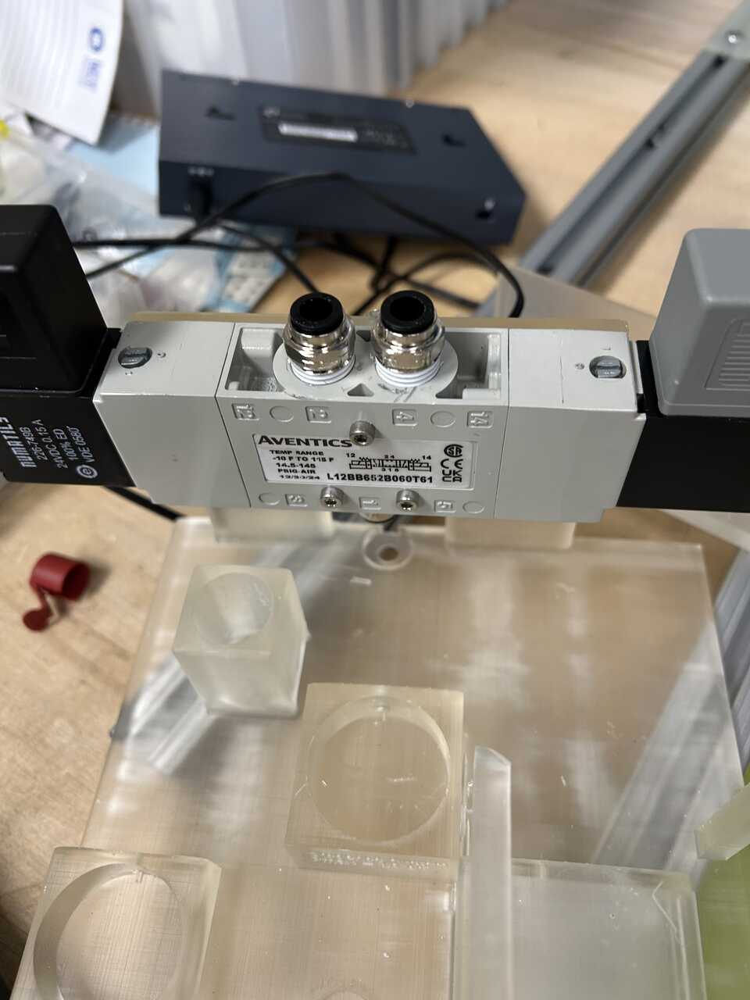

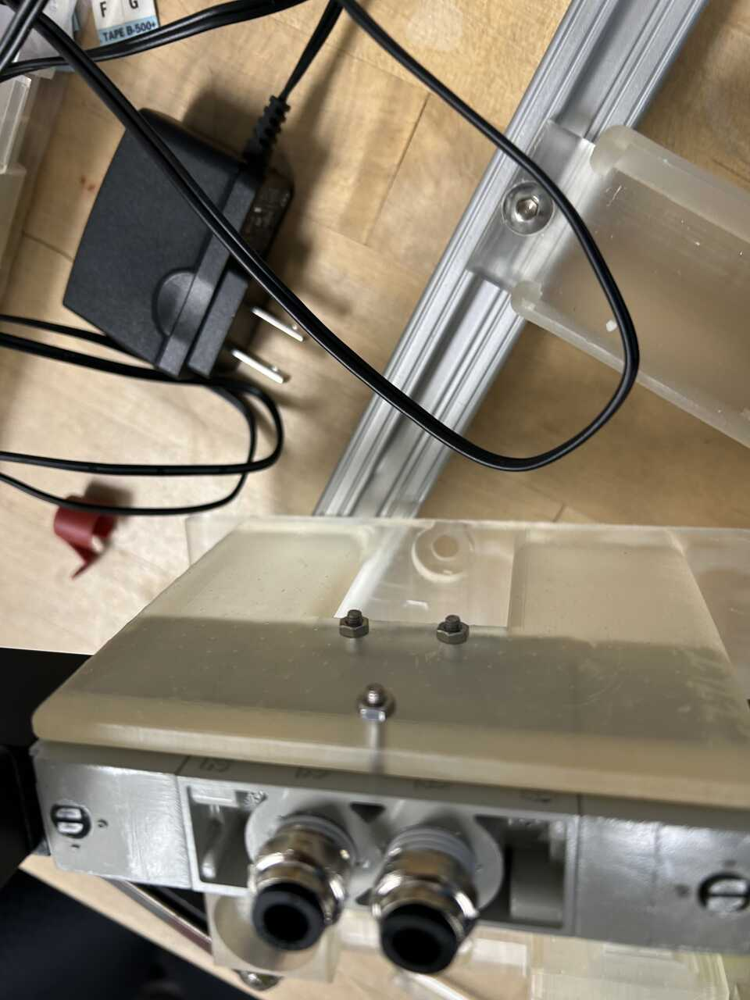
* Mount the full-up microswitch arm with the attached switch to the left side of the frame using 2 [#4-40 screws, 1/2" long](Parts.yaml#440Screw12inSS){Qty: 2}.

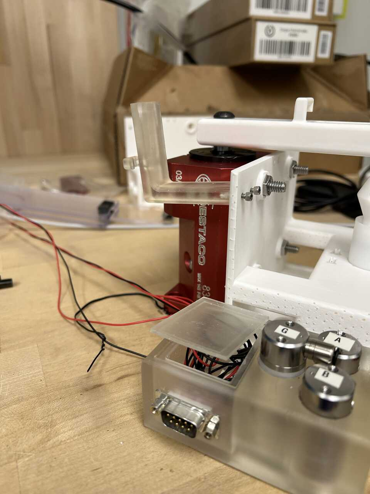
* Using a [long 3/16" hex head driver]{Qty: 1, Cat:tool} and 2 [1/4"-20 socket head cap screws, 3/4" long](Parts.yaml#1420Screw12inSS){Qty:2}, mount the assembled valve box to the left side of the frame.  Pay attention to the wire routing.  The two dangling connectors should exit the frame/box junction at the back.
* Using a [3/16" hex key]{Qty: 1, Cat: tool}, mount the [Actuator Piston Arm] to the actuator.  Be cautious with this mounting.  It needs to be firm, but not so firm you crack the arm.  It should resist a moderate rotational force from the end of the arm without slipping.

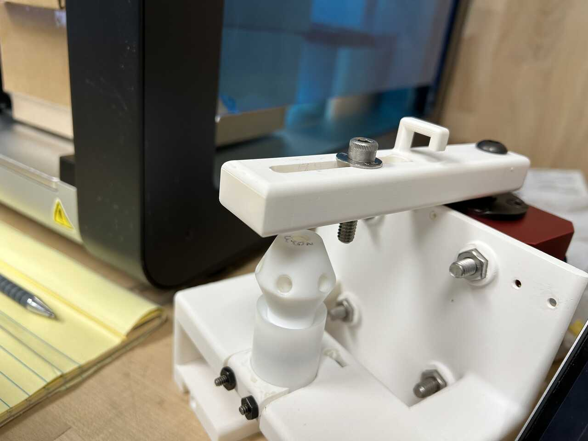

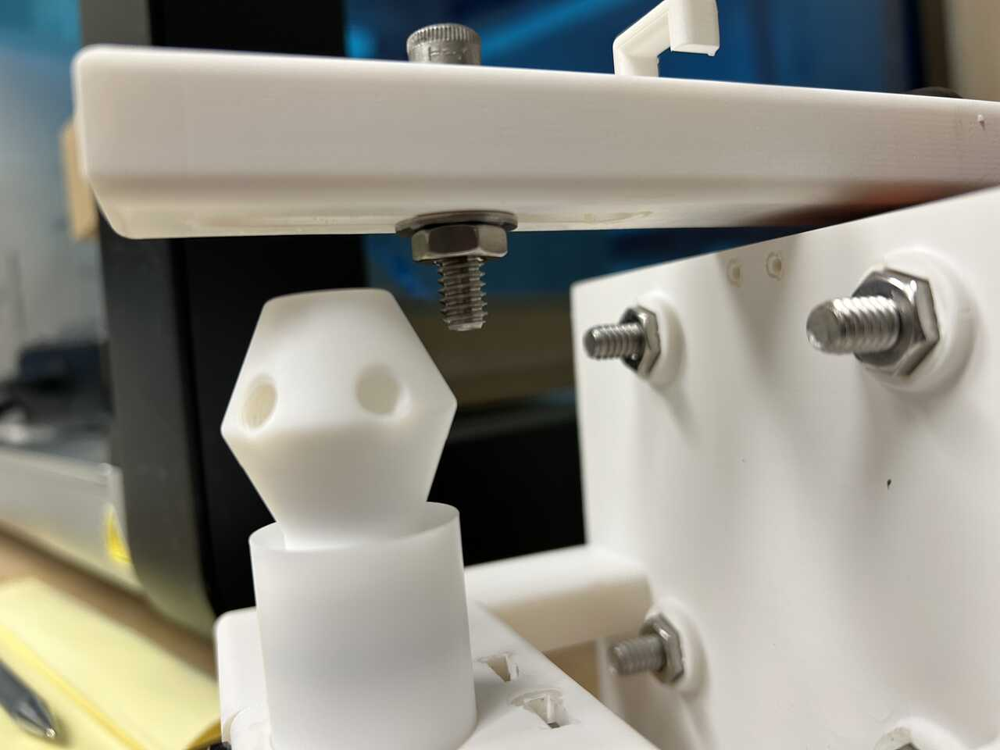

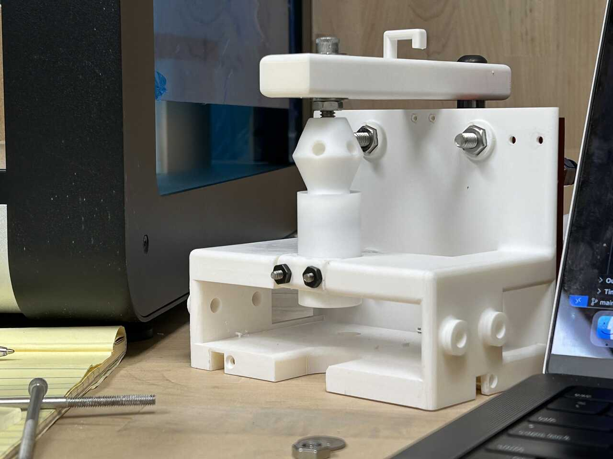

## Install the piston and catch into the frame {pagestep}

{{includetext: "{previewpage}", if: targetformat is html}}

* Take the [AFL piston](AFLPistonCatch.md){Qty: 1} and [AFL Catch](AFLPistonCatch.md){Qty: 1}.  Start with the catch alone first and rotate the piston arm to the fully-up position. 
* You may find it helpful to make up the fluidic connection on the catch bottom first using [1/16" PP or ETFE tubing]{Qty: some} and [1/4"-28 x 1/16" tube flangeless nuts and ferrules]{Qty: 1}  
>i **Note**
>i If you are using a machined PTFE catch, use great caution to avoid over-torquing the PTFE threads.  It would be prudent to use some [thread locker compound]{Qty: some} on these connections.

* Using two [#6-32 screws, 2" long](Parts.yaml#832Screw2inSS){Qty: 2}, two [#6-32 nuts](832NutSS){Qty: 2}, and the 3D printed [AFL catch nut]{Qty: 1}, install the catch in the frame.  If using a rev. E or later frame (you are), drop the nuts into the holes in the frame and thread the bolts in.  Ensure the nut falls fully; you may need to tap it in place.  Place a [catch nut] on the outside of the catch and run the screws through the catch nut, through the catch, and into the captive nut.  Tighten until snug.  Route the tubing out the right or left side of the catch frame at the rear.

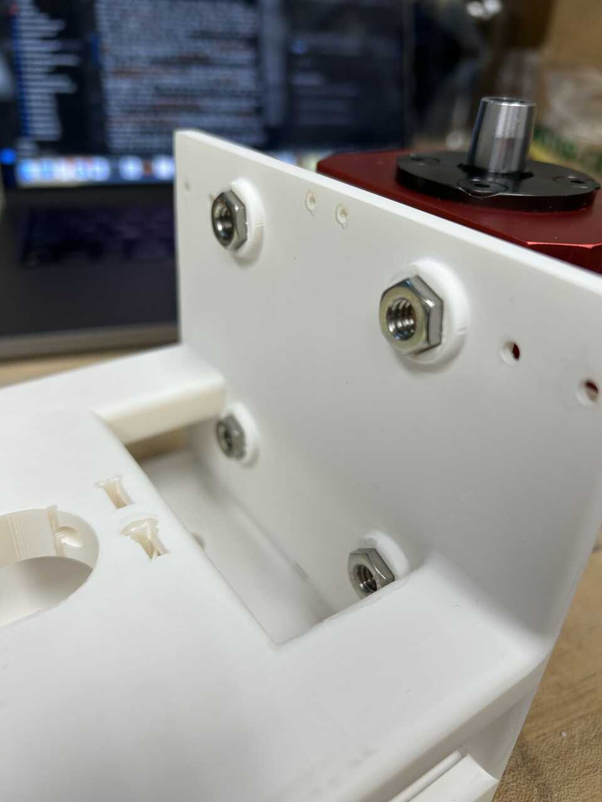

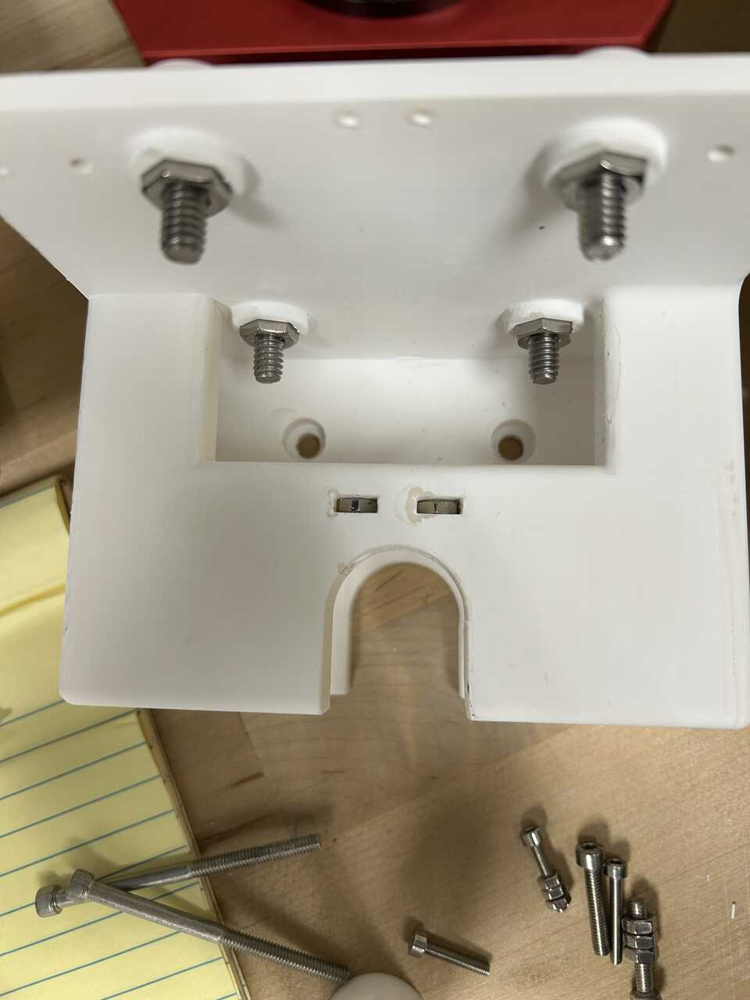

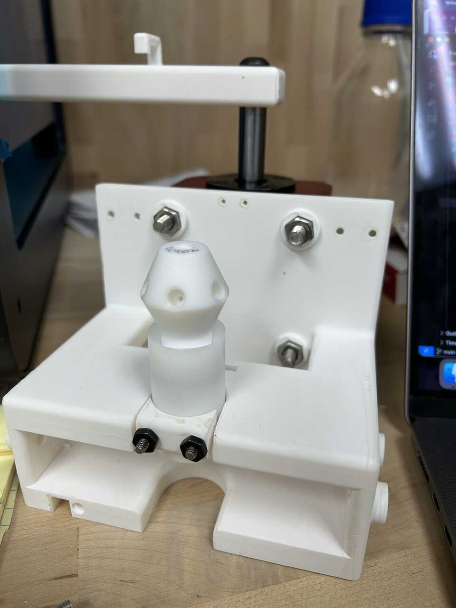
* Now, place the [AFL piston] with its [piston o-ring](Parts.yaml#PistonORing){Qty: 1} into the catch, and lower the catch arm.
* Pre-thread  a [1/4" washer](Parts.yaml#14WasherSS){Qty: 1} onto a a [1/4"-20 socket head cap screw, 1 1/4" long](Parts.yaml#1420Screw2inSS){Qty: 1}, in the sequence bolt head > washer > threaded end. You can use a longer bolt if you prefer, just add a [1/4"-20 nut]{Qty: 1} between the head and washer.
* On the arm bottom, loosely hold a [1/4"-20 nut](Parts.yaml#1420NutSS){Qty: 1} and a [1/4" washer](Parts.yaml#14WasherSS){Qty: 1}, and run the bolt through the arm and thread into the nut.  Leave loose enough for the bolt to freely rotate in the arm.  The sequence on the bolt should now be bolt head > (opt. nut) > washer > arm > washer > nut.
* Gently thread the bolt into the top, 1/4"-20 threads on the piston.  It may be helpful to manually lift the arm slightly to get it in place.  The bolt should bottom out in the hole and you should tighten the bolt to the piston (See note above regarding PTFE threads!) such that the bolt and piston spin as one assembly.  If space permits (depends on the nuts you use), you might find it useful to use a nut against the piston head to prevent rotation.
* If you used a longer bolt: Set the piston height by rotating the nuts above/below the catch arm.  You want the piston to be as deep as possible in the catch (for maximum engagement/compression of its o-ring seal) while still clearing the catch edge as it moves up and out of the catch.  It is best to manually move the catch arm into this intermediate position and set the height using the bolts so that it just clears.
* If you used the 1 1/4" bolt: Fully tighten the nut against the upper arm by gripping the nut with a [needle nose pliers]{Qty: 1, Cat: tool} and rotating the shaft.  If you have a bicycle-style "cone wrench" (thin wrench) that is the proper tool, but you shouldn't be applying that much torque anyway, so the piliers works fine.  
* Check that the piston travels smoothly past the catch "shoulder" and the o-ring fully engages in the catch.  Some binding is OK.

## Make-up internal plumbing/pneumatic connections. {pagestep}
* Attach three [1/4"-28 inlet check valves](Parts.yaml#InlineCheckValve){Qty: 3} to three fluidic ports on the piston.  You may wish to use some [thread locker compound]{Qty: some} to secure these.

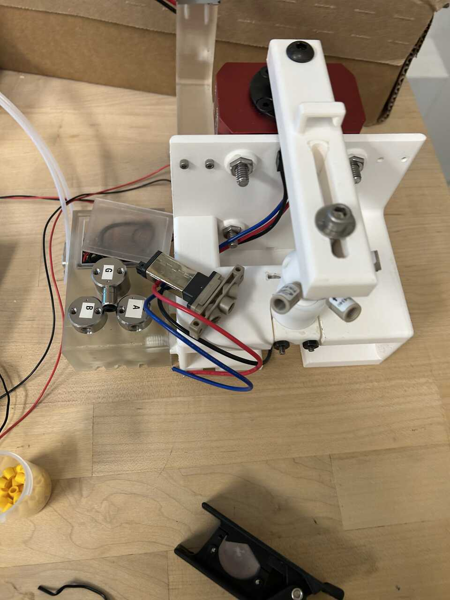
* Attach a [Burkert whisper valve, type A](Parts.yaml#WhisperValveA){Qty: 1} to the piston arm using [electrical tape or similar]{Qty: some}, with the ports facing out.

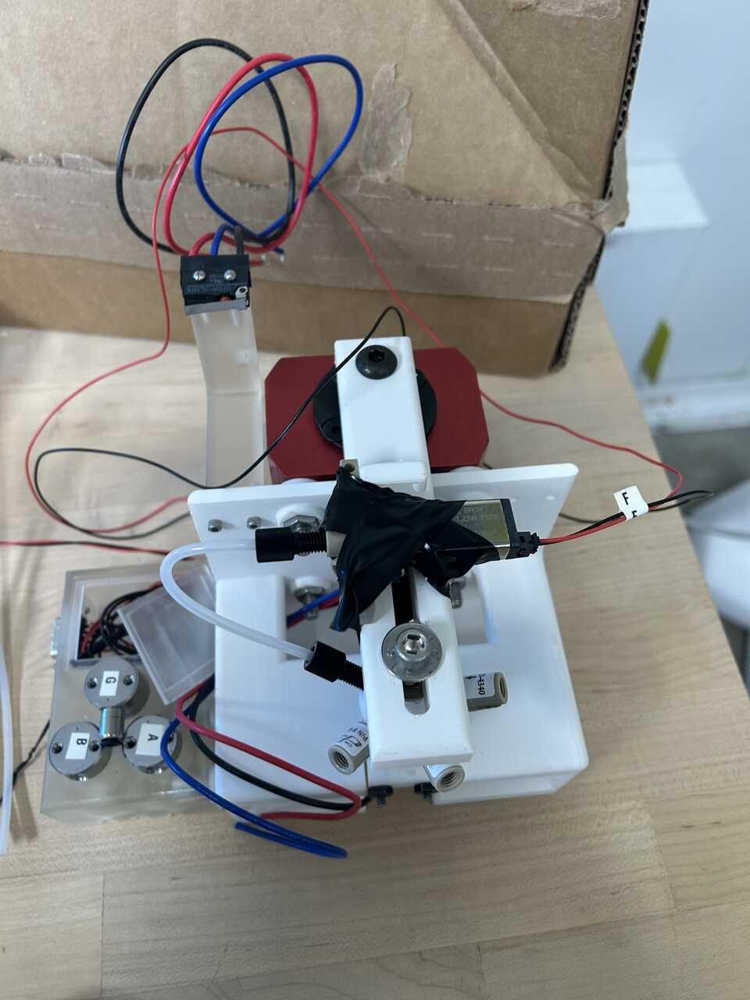
* Using [1/16" PP or ETFE tubing]{Qty: some} and [1/4"-28 x 1/16" tube flangeless nuts and ferrules]{Qty: 2} , make the shortest reasonable connection between one port on the valve and the check valve-free port on the piston head.  This is the piston top vent port, which allows the piston head to close without applying pressure shockwaves to the sample.

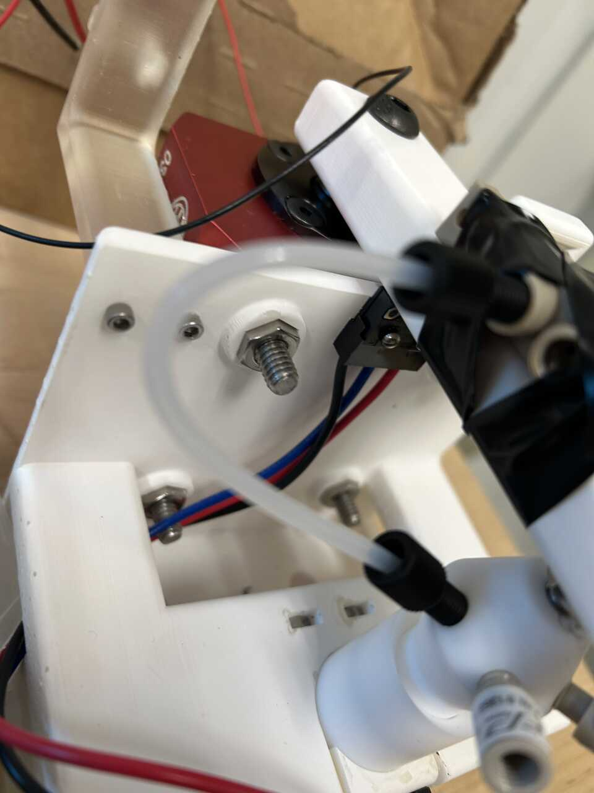

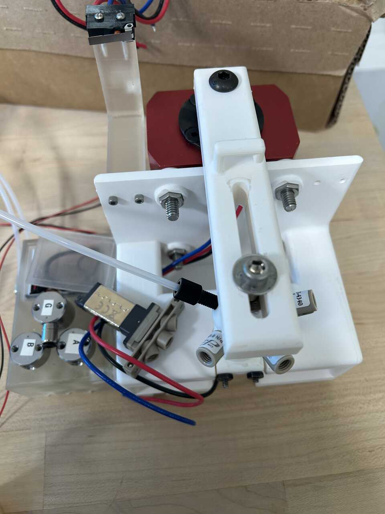
* Using [1/8" PP or ETFE tubing]{Qty: some} and [1/4"-28 x 1/8" tube flangeless nuts and ferrules] on the piston end only, attach short lengths (~ 1 ft / 20 cm) of tubing to two of the check valve-equipped ports.

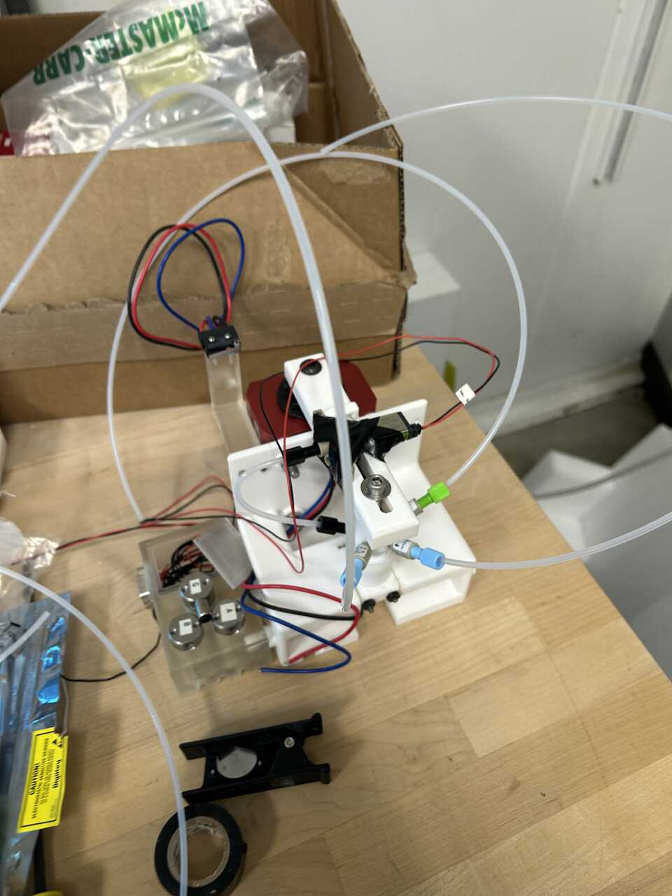 
* One tube will directly connect to the central solenoid valve in the box (the "blowout") valve.  Cut (using a [plastic tube cutter]{Qty: 1, Cat: tool}) the tube to a precise length that allows the arm to rotate without excess slack, then push it into the push connect on the valve.
* The two rinse tubes are combined using a [1/8" push connect tee fitting](Parts.yaml#PushConnectTee18){Qty: 1} just after the valve box.  Cut two short 2-3" lengths of tubing and run them from the valve exit into the two co-linear ports of the tee.  Cut the dangling tube from the piston head to appropriate length, then attach to the perpendicular port of the tee.
* The final port goes to the dispense controller.  Run a longer length of [1/8" PP or ETFE tubing], perhaps as long as 1 m, from the piston head.

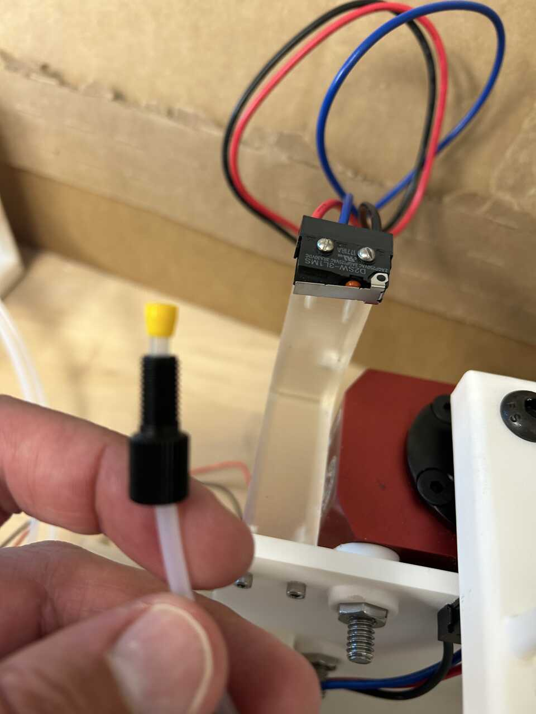
* Attach a dangling RJ11 jack to the electronics box 
* Connect the wiring from this valve to the appropriate pins on the DB9 connector (pin 5 as per the pin diagram).

## Connect the electrical components {pagestep}

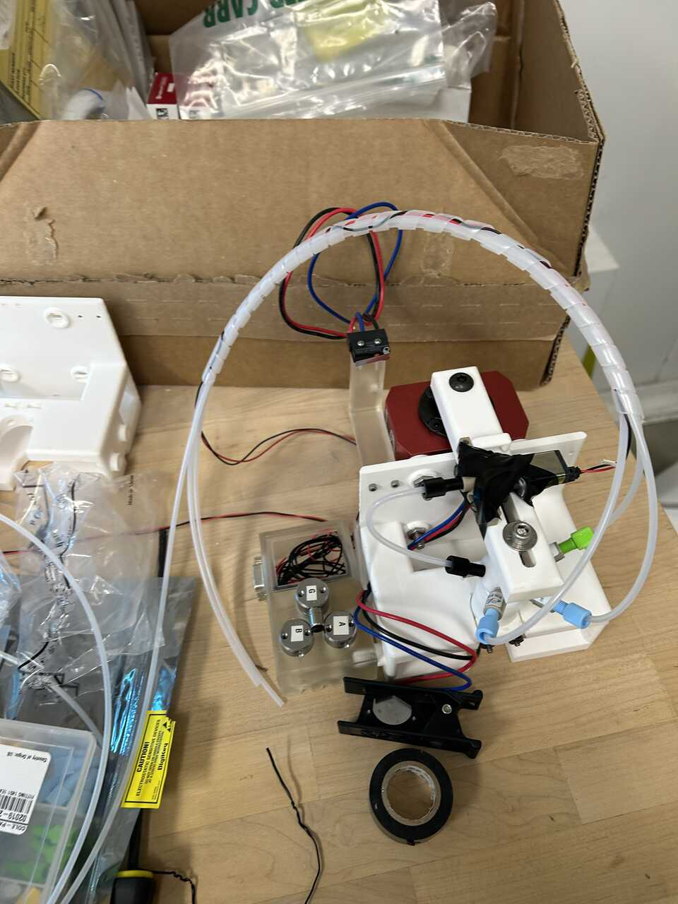

* Verify all valve connections to the DB9 connector according to the pin diagram provided earlier.
* Connect the limit switch harness to the electronics module using a RJ45 cable.

## Install the in-robot module in the OT-2 {pagestep}

{{includetext: "{previewpage}", if: targetformat is html}}

* Ensure the OT-2 is powered off before installing the in-robot module.
* Carefully place the assembled in-robot module into slot 10 of the OT-2 deck. The module should fit securely with the pneumatic clamp aligned with the deck slot.
* Route the pneumatic tubing and electrical connections through the appropriate access points in the OT-2 chassis.

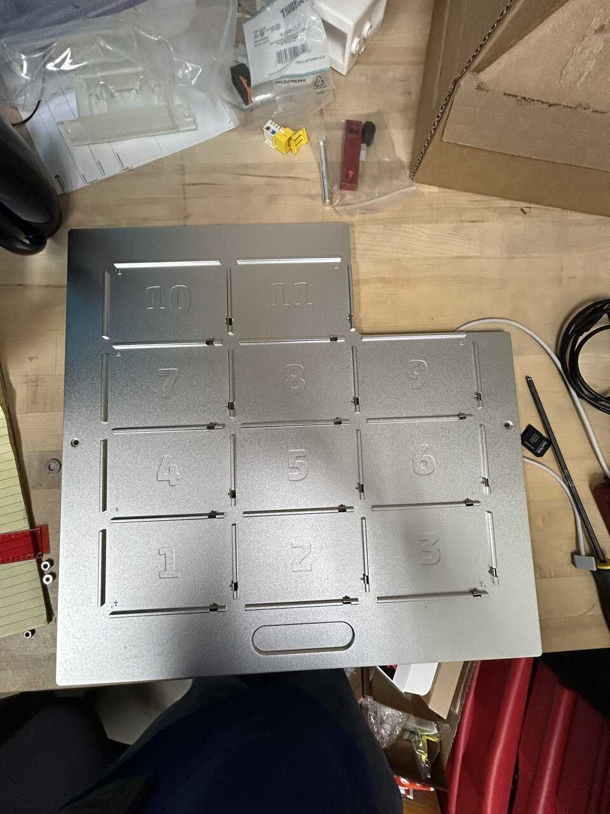

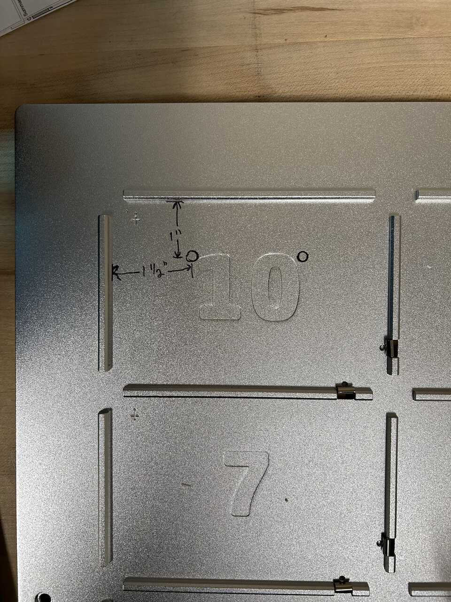

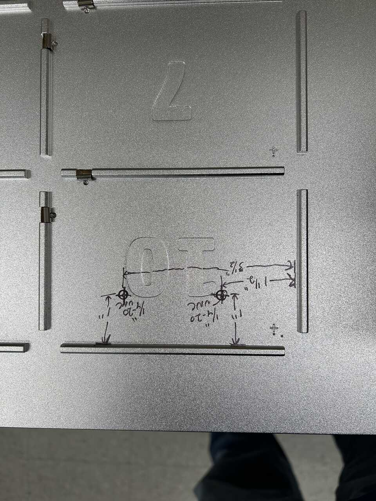

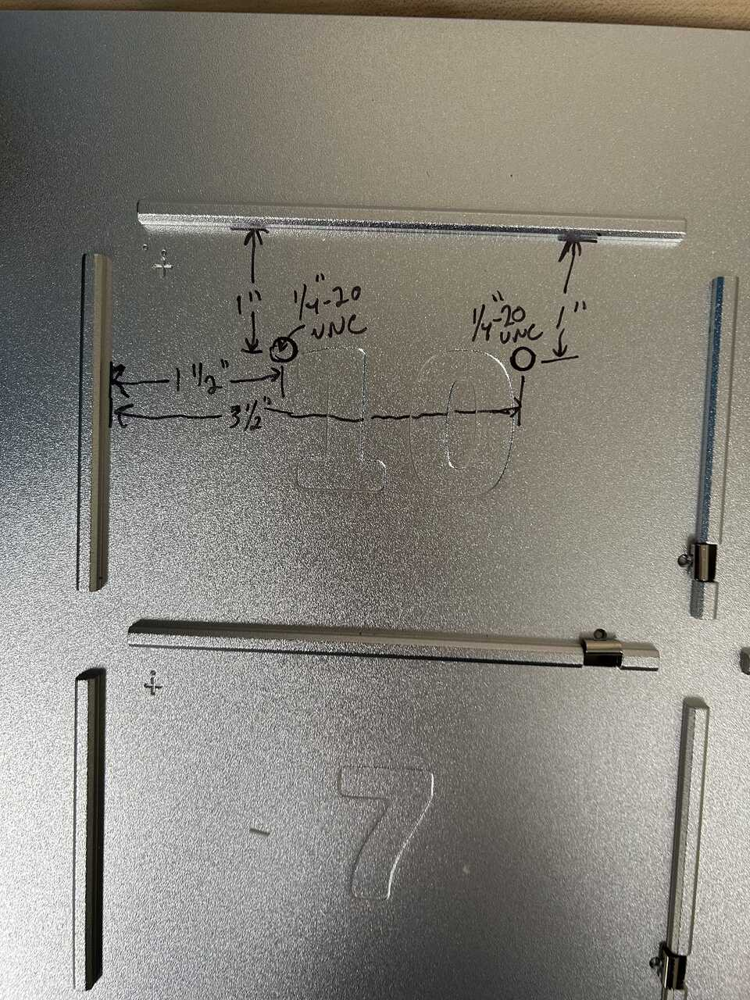
* Connect the DB9 connector to the corresponding connector on the electronics module.
* Connect the RJ45 jack from the interlock harness to the corresponding port on the electronics module.
* Install the door switch carrier on the OT-2 door frame using the magnets to secure it in place. Adjust the position so that the switch is properly activated when the door is closed.

## Connect the pneumatic lines {pagestep}

* Connect the main pneumatic line from the pneumatic module to the actuator using [1/4" nylon tubing](Parts.yaml#NylonTube14OD){Qty: 1, Unit: ft, Qty_Value: 3}.
* Connect the dispensing pneumatic lines from the pneumatic module to the appropriate ports on the in-robot module using [1/8" ETFE tubing](Parts.yaml#ETFETube18OD){Qty: 1, Unit: ft, Qty_Value: 3}.
* Ensure all pneumatic connections are secure and free from leaks.

## Test the in-robot module {pagestep}

* Power on the OT-2 and the control system.
* Test the actuator movement by sending the appropriate control signals. Verify that:
  * The actuator moves smoothly between the up and down positions
  * The limit switches correctly detect the full-up and full-down positions
  * The door interlock switch correctly prevents operation when the door is open
* Test the pneumatic functions by activating each valve and verifying proper operation:
  * Rinse valves (1 and 2)
  * Blowout valve
  * Piston vent valve
  * Cell flow-through valve
* Test the dispensing function by connecting a source of liquid and verifying proper dispensing through the piston.

## Troubleshooting {pagestep}

* If the actuator does not move:
  * Check the pneumatic connections for leaks
  * Verify the control signals are reaching the five-way valve
  * Check that the door interlock and limit switches are functioning correctly
* If the valves do not activate:
  * Check the electrical connections to the DB9 connector
  * Verify the control signals are reaching the valves
  * Check for proper voltage (24V) at the valve terminals
* If dispensing is inconsistent:
  * Check for leaks in the fluidic path
  * Verify the check valves are installed in the correct orientation
  * Check for blockages in the tubing or fittings

