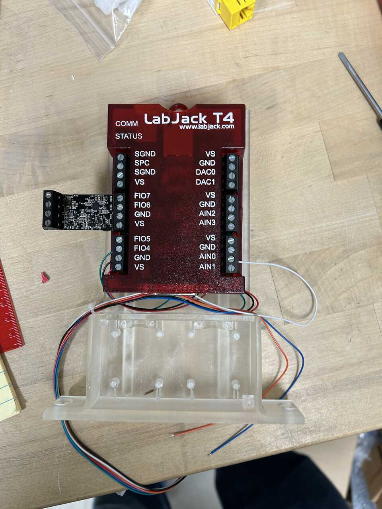
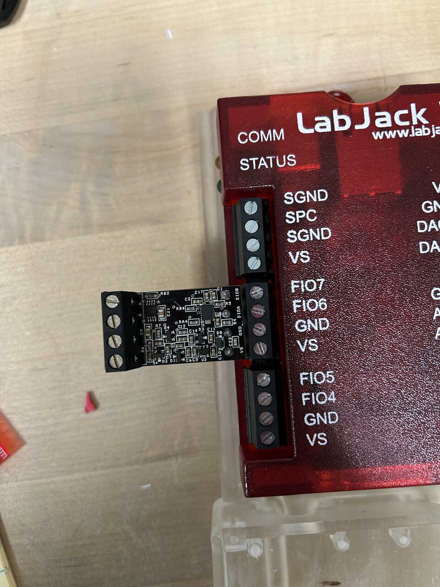
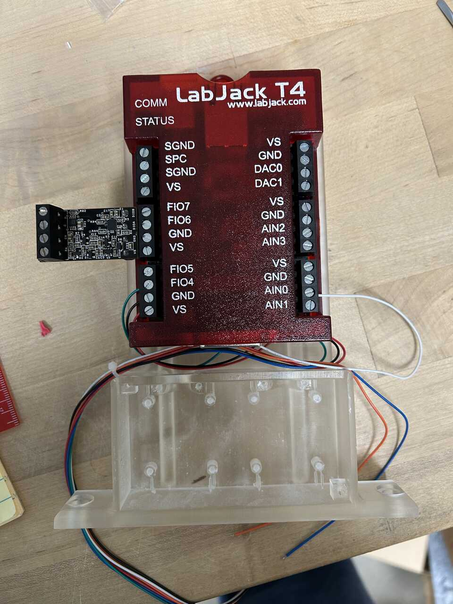
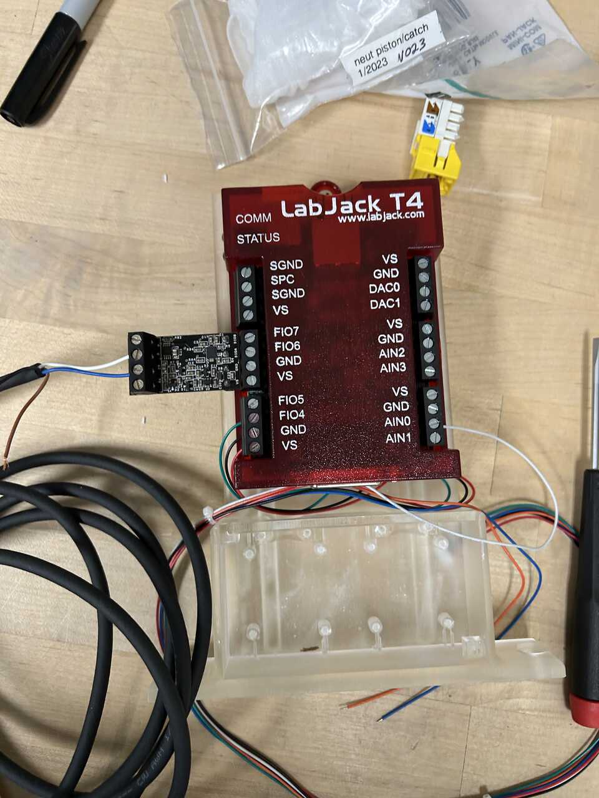

# LabJack Carrier Module
{{BOM}}

The role of the LabJack carrier module is to consolidate a LabJack T4 with the control/readout boards for up to two OCB100AZ liquid/gas sensors in a single physical module.  The LabJack provides readout of the sensors and can provide a 0-10V analog out signal to drive the pressure of the dispense controller.

 
## Prepare the Housing {pagestep}

{{includetext: "{previewpage}", if: targetformat is html}}

{{includetext: "{previewpage}", if: targetformat is html}}

* 3D print the [AFL LabJack carrier]{Qty: 1}, [AFL LabJack carrier cover]{Qty: 1} and tap the 2 labjack mounting holes using a [#8-32 tap]{Qty: 1, Cat: tool}, the 12 (!) mounting holes for the OCB100AZ sensors using a [#2-56 tap]{Qty: 1, Cat: tool}, and the 2 front cover mounting holes using a [#4-40 tap]{Qty: 1, Cat: tool}.		

## Prepare the LabJack and other boards {pagestep}

Mount the LabJack to the board using two [8-32 screws]{Qty: 2}.  

If using detachable sensors:

Solder a female M4 connector to the OCB100AZ board and mount it to the carrier using 4 [2-56 x 1/4" screws]{Qty: 4}. Repeat for the other board if desired.  Thread the Molex wiring harness up the outer hole and save for connection later.

Secure the board area cover using 2 [4-40 screws, 1/2" long]{Qty: 2}. 

## Make up LabJack connections

If using the digital out to drive the dispense controller, install a [LJTick-DAC]{Qty: 1} to the LabJack on the block with FIO7 at the top.  Double check that the silkscreen on the LJtick matches the LabJack: VS to VS, GND to GND, DIOA to FIO6, and DIOB to FIO7.  Tighten the 4 terminal screws.

Connect the wiring harness from the OCB board (either floating or in the mounting frame) to the LabJack: red to VS, black to GND, green (sensor reset/calibrate) to FIO4, white (sensor voltage) to AIN0.  If using a second sensor, wire it as above but green to FIO5 and white to AIN1.

Take the [connector for the dispense controller]{Qty: 1} and connect it to the LJTick-DAC: white (input) to DACA, blue (common) to GND.  We will need to route 24V power to the device using brown (24V).  Black (output) will not be used.

